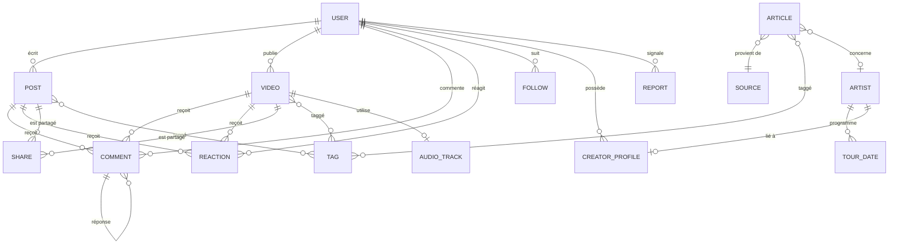
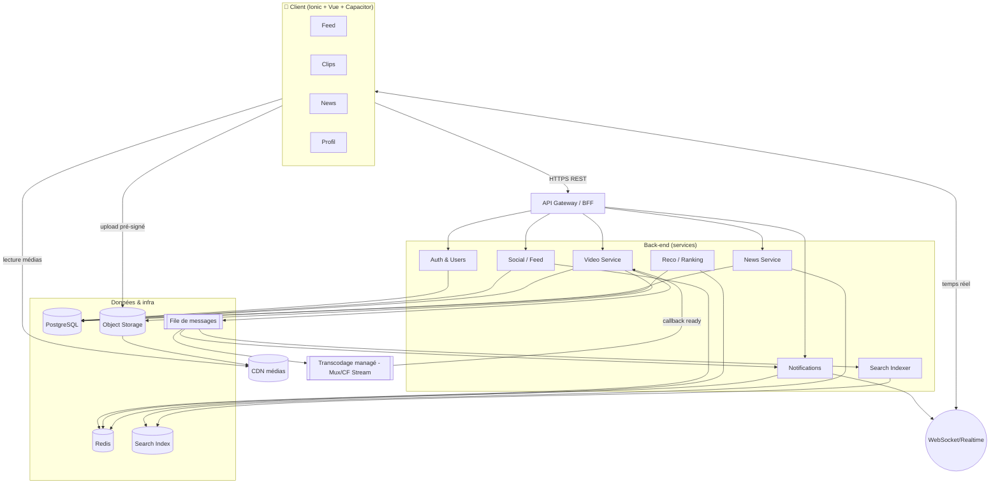

# Plan Produit — RapidMusic

> Réseau social axé sur la musique, pensé **mobile-first** pour un public **jeune** (≈ 15–30 ans).
> Ce document est le plan produit de référence : vision, fonctionnalités, modèle de données, pile
> technique, architecture, feuille de route MVP, exigences non fonctionnelles, API, livrables et
> user stories.

**Version :** 1.0 · **Date :** 2026-07-24 · **Statut :** Proposition (à valider)

---

## Table des matières

0. [Contexte & état actuel du dépôt](#0-contexte--état-actuel-du-dépôt)
1. [Vision du produit et rôles utilisateurs](#1-vision-du-produit-et-rôles-utilisateurs)
2. [Fonctionnalités et priorités (MVP vs améliorations)](#2-fonctionnalités-et-priorités-mvp-vs-améliorations)
3. [Modèle de données](#3-modèle-de-données)
4. [Pile technologique](#4-pile-technologique)
5. [Architecture (modules/services & flux de données)](#5-architecture-modulesservices--flux-de-données)
6. [Plan MVP : jalons & critères de succès](#6-plan-mvp--jalons--critères-de-succès)
7. [Exigences non fonctionnelles](#7-exigences-non-fonctionnelles)
8. [API & accès aux données](#8-api--accès-aux-données)
9. [Livrables](#9-livrables)
10. [User stories & critères d'acceptation](#10-user-stories--critères-dacceptation)
- [Annexes : KPIs, risques, glossaire](#annexes)

---

## 0. Contexte & état actuel du dépôt

Le dépôt `rapid-music` contient déjà un **starter Ionic + Vue + Capacitor** à 3 onglets. Cette base
cadre directement les 3 surfaces principales du produit :

| Onglet existant | Devient | Fonctionnalité |
|---|---|---|
| `Tab1.vue` | **Feed** | Fil d'actualité principal (style LinkedIn) |
| `Tab2.vue` | **Clips** | Onglet type TikTok (vidéos verticales) |
| `Tab3.vue` | **News** | Actualités musicales sélectionnées |

Pile détectée :

- **Framework UI :** Ionic 5 + Vue 3 (Composition API) + `@ionic/vue-router`
- **Runtime natif :** Capacitor 3 (plugins `app`, `haptics`, `keyboard`, `status-bar`)
- **Langage :** TypeScript (`strict: true`)
- **Tests :** Jest (unit) + Cypress (e2e)
- **Build :** Vue CLI 4

> **Décision cadre :** on **conserve** Ionic/Vue/Capacitor comme base. C'est un choix pertinent pour
> livrer vite iOS + Android + web à partir d'une seule base de code. Seule réserve : l'onglet
> vidéo « TikTok » exige une attention particulière aux performances de lecture (voir §4).

---

## 1. Vision du produit et rôles utilisateurs

### 1.1 Énoncé de vision

> **RapidMusic est l'endroit où la culture musicale se vit et se partage** : les fans y suivent
> l'actualité, découvrent des artistes en clips courts, et échangent autour de la musique, pendant
> que créateurs et médias y trouvent une audience jeune et engagée.

Trois surfaces complémentaires en un seul produit :

1. **Feed social/pro** — publications structurées, discussions, veille (posture « LinkedIn de la
   musique »).
2. **Clips** — vidéos verticales courtes en lecture automatique (posture « TikTok »), pour la
   découverte rapide et virale.
3. **News** — actualité musicale curée et fiable (sources identifiées), searchable et filtrable.

### 1.2 Proposition de valeur

- **Pour les fans :** un seul endroit pour suivre l'actu, découvrir et interagir, sans le bruit des
  réseaux généralistes.
- **Pour les créateurs/artistes :** une audience ciblée « musique », des outils de publication et
  des statistiques.
- **Pour les médias :** un canal de distribution d'articles vers un public jeune.

### 1.3 Rôles utilisateurs (personas)

| Rôle | Description | Objectifs principaux |
|---|---|---|
| **Visiteur** (non authentifié) | Découvre le produit en lecture seule (selon config) | Parcourir clips/news publics, s'inscrire |
| **Auditeur / Fan** | Utilisateur standard | Suivre, aimer, commenter, partager, découvrir |
| **Créateur / Artiste** | Compte vérifiable publiant du contenu | Publier posts & clips, gérer un profil créateur, voir des stats, annoncer des dates de tournée |
| **Média / Journaliste** | Source d'articles | Publier/soumettre des articles, citer des sources |
| **Modérateur** | Équipe confiance & sécurité | Traiter signalements, retirer contenu, sanctionner |
| **Administrateur** | Équipe interne | Gérer rôles, curation News, configuration, feature flags |

### 1.4 Matrice de permissions (résumé)

| Action | Visiteur | Fan | Créateur | Média | Modérateur | Admin |
|---|:--:|:--:|:--:|:--:|:--:|:--:|
| Lire contenu public | ✅ | ✅ | ✅ | ✅ | ✅ | ✅ |
| Aimer / commenter / partager | ❌ | ✅ | ✅ | ✅ | ✅ | ✅ |
| Publier un post (feed) | ❌ | ✅ | ✅ | ✅ | ✅ | ✅ |
| Publier un clip vidéo | ❌ | ⚠️¹ | ✅ | ⚠️¹ | ✅ | ✅ |
| Profil créateur & stats | ❌ | ❌ | ✅ | ✅ | ✅ | ✅ |
| Soumettre / publier un article News | ❌ | ❌ | ⚠️² | ✅ | ✅ | ✅ |
| Modérer (retirer, avertir, bannir) | ❌ | ❌ | ❌ | ❌ | ✅ | ✅ |
| Gérer rôles / config / curation | ❌ | ❌ | ❌ | ❌ | ❌ | ✅ |

¹ Activable pour tous au lancement ou réservé aux créateurs (feature flag) selon la stratégie de modération.
² Les créateurs peuvent *soumettre*, la publication reste soumise à curation.

---

## 2. Fonctionnalités et priorités (MVP vs améliorations)

Légende priorité : **P0** = indispensable MVP · **P1** = fast-follow post-MVP · **P2** = amélioration · **P3** = exploratoire.

### 2.1 Transverse (comptes & socle)

| Fonctionnalité | Priorité | Palier |
|---|:--:|:--:|
| Inscription / connexion (email + OAuth social) | P0 | MVP |
| Profil utilisateur (avatar, bio, genres favoris) | P0 | MVP |
| Système d'**abonnements** (follow/unfollow) | P0 | MVP |
| Recherche globale (utilisateurs, articles, tags) | P0/P1 | MVP/V1.1 |
| Notifications (in-app puis push) | P1 | V1.1 |
| Signalement & modération de base | P0 | MVP |
| Vérification de compte créateur (badge) | P2 | V1.2 |

### 2.2 Feed principal (style LinkedIn)

| Fonctionnalité | Priorité | Palier |
|---|:--:|:--:|
| Composer un post (texte, image, lien, tags) | P0 | MVP |
| Fil chronologique des abonnements | P0 | MVP |
| **J'aime**, **commentaires**, **partages** (repost) | P0 | MVP |
| Fil de commentaires (réponses imbriquées 1 niveau) | P1 | V1.1 |
| Mentions `@utilisateur` et hashtags `#genre` | P1 | V1.1 |
| Feed « Pour toi » (recommandation) | P2 | V1.2 |
| Enregistrement / signets de posts | P2 | V1.2 |

### 2.3 Onglet Clips (style TikTok)

| Fonctionnalité | Priorité | Palier |
|---|:--:|:--:|
| Lecteur vertical plein écran + **lecture automatique** | P0 | MVP |
| Scroll infini / swipe vertical | P0 | MVP |
| **J'aime**, **commentaires**, **partages** sur clip | P0 | MVP |
| Upload de vidéo (mobile) + transcodage | P0 | MVP |
| **Profils de créateurs** (grille de clips, abonnés) | P0 | MVP |
| Sons / extraits audio attachés au clip | P2 | V1.2 |
| Duo / stitch / réponses vidéo | P3 | V2 |
| Flux « Découverte » algorithmique | P2 | V1.2 |

### 2.4 Actualités musicales (News)

| Fonctionnalité | Priorité | Palier |
|---|:--:|:--:|
| Liste d'**articles curés** avec **source** citée | P0 | MVP |
| Vue détail article (résumé + lien source) | P0 | MVP |
| **Recherche** dans les articles | P0 | MVP |
| **Filtres** (genre, source, date, artiste) | P0 | MVP |
| Ingestion automatisée (RSS / API partenaires) | P1 | V1.1 |
| Sauvegarde / lecture hors-ligne d'articles | P2 | V1.2 |

### 2.5 Idées additionnelles (optionnelles)

| Idée | Priorité | Palier | Note |
|---|:--:|:--:|---|
| **Extraits audio** (snippets 30 s) | P2 | V1.2 | Nécessite accords de licence (Spotify/Apple previews) |
| **Playlists** partageables | P2 | V1.2 | Intégration API streaming |
| **Événements** (concerts, sorties) | P2 | V1.2 | Base pour la billetterie future |
| **Découverte / recommandations** | P2 | V1.2 | Moteur reco (voir §5) |
| **Calendrier de tournées** par artiste | P3 | V2 | Données via API type Bandsintown/Songkick |

---

## 3. Modèle de données

### 3.1 Diagramme entité-relation (ERD)

### 3.2 Entités principales (schéma logique)

Conventions : `PK` clé primaire (UUID), `FK` clé étrangère, `?` nullable, `[]` collection.
Champs communs implicites : `created_at`, `updated_at`, `deleted_at?` (soft delete).

**USER**
| Champ | Type | Note |
|---|---|---|
| id `PK` | UUID | |
| handle | string(30) unique | `@nom_utilisateur` |
| display_name | string(80) | |
| email | string unique | privé |
| password_hash? | string | null si OAuth pur |
| avatar_url? | string | |
| bio? | text | |
| role | enum | fan · creator · media · moderator · admin |
| favorite_genres | string[] | onboarding |
| is_verified | bool | badge créateur |
| birthdate | date | contrôle d'âge (RGPD / mineurs) |
| status | enum | active · suspended · deleted |

**CREATOR_PROFILE**
| Champ | Type | Note |
|---|---|---|
| id `PK` | UUID | |
| user_id `FK` | UUID | 1–1 avec USER |
| stage_name | string | |
| links | jsonb | Spotify, Insta, site |
| genres | string[] | |
| follower_count | int (dénormalisé) | cache lecture |

**POST** (feed)
| Champ | Type | Note |
|---|---|---|
| id `PK` | UUID | |
| author_id `FK` | UUID | → USER |
| body | text | |
| media | jsonb[] | {type: image/link, url} |
| visibility | enum | public · followers |
| like_count / comment_count / share_count | int | compteurs dénormalisés |
| reposted_from? `FK` | UUID | repost/partage |

**VIDEO** (clip)
| Champ | Type | Note |
|---|---|---|
| id `PK` | UUID | |
| creator_id `FK` | UUID | → USER |
| caption? | text | |
| source_asset_url | string | fichier original (stockage objet) |
| hls_url? | string | manifeste HLS après transcodage |
| poster_url? | string | vignette |
| duration_ms | int | |
| width / height | int | vertical (9:16) |
| audio_track_id? `FK` | UUID | son associé |
| status | enum | uploading · processing · ready · failed · removed |
| view_count / like_count / comment_count / share_count | int | compteurs |

**ARTICLE** (news)
| Champ | Type | Note |
|---|---|---|
| id `PK` | UUID | |
| title | string | |
| summary | text | |
| body_html? | text | si contenu propre |
| external_url | string | lien source |
| source_id `FK` | UUID | → SOURCE |
| author_name? | string | |
| image_url? | string | |
| artist_id? `FK` | UUID | → ARTIST |
| published_at | timestamp | |
| curation_status | enum | draft · submitted · approved · rejected |

**SOURCE**
| Champ | Type | Note |
|---|---|---|
| id `PK` · name · domain · logo_url? · trust_level (enum) | | fiabilité affichée |

**TAG** (genres, thèmes, hashtags)
| Champ | Type | Note |
|---|---|---|
| id `PK` · slug (unique) · label · kind (enum: genre/topic/hashtag) | | |

Table de jointure `TAGGABLE` (polymorphe) : `tag_id`, `taggable_type` (post/video/article), `taggable_id`.

**Interactions**

- **REACTION** : `id`, `user_id`, `target_type` (post/video/comment), `target_id`, `type` (like…), *unicité (user,target)*.
- **COMMENT** : `id`, `author_id`, `target_type`, `target_id`, `parent_comment_id?`, `body`, `like_count`.
- **SHARE** : `id`, `user_id`, `target_type`, `target_id`, `channel` (repost/external).
- **FOLLOW** : `follower_id`, `followee_id`, *unicité de la paire*.
- **REPORT** : `id`, `reporter_id`, `target_type`, `target_id`, `reason` (enum), `status` (open/actioned/dismissed).

**AUDIO_TRACK** (extraits/sons — V1.2) : `id`, `title`, `artist_id?`, `preview_url`, `duration_ms`, `license_ref`.

**ARTIST / TOUR_DATE** (calendrier tournées — V2) :
- ARTIST : `id`, `name`, `genres[]`, `creator_profile_id?`, `external_ids` (jsonb).
- TOUR_DATE : `id`, `artist_id`, `city`, `venue`, `country`, `starts_at`, `tickets_url?`.

> **Choix de stockage :** modèle relationnel principal (PostgreSQL). Les compteurs (`*_count`) sont
> **dénormalisés** pour la lecture et mis à jour de façon asynchrone (§5). Recherche News/tags via
> index dédié (OpenSearch/Meilisearch).

---

## 4. Pile technologique

### 4.1 Front-end (mobile & web)

- **Conserver Ionic 5 + Vue 3 + Capacitor 3** (base existante). Une base de code → **iOS, Android, PWA**.
- **State management :** Pinia (recommandé pour Vue 3) plutôt que Vuex.
- **Data fetching / cache :** `@tanstack/vue-query` (cache, retry, invalidation, pagination infinie idéale pour feed & clips).
- **Composants :** Ionic UI + composants métier maison (carte post, lecteur clip, carte article).
- **Vidéo (critique) :** lecteur HLS via `hls.js` (web/Android) et lecture native HLS (iOS). Pour un
  feel « TikTok » vraiment natif, prévoir en option un composant natif Capacitor (ExoPlayer/AVPlayer)
  si les tests de perfermance montrent des limites du `<video>` HTML.

> **Mise à jour de version :** la base est sur Ionic 5 / Capacitor 3 / Vue CLI. Prévoir dès le
> sprint 0 une **migration vers Vite + Capacitor 6/7 + Ionic 8** (Vue CLI n'est plus maintenu). À
> chiffrer comme dette technique initiale.

### 4.2 Back-end

- **API :** Node.js + **NestJS** (TypeScript — cohérent avec le front) exposant **REST** (OpenAPI) ;
  GraphQL en option si l'agrégation feed devient complexe.
- **Auth :** OIDC/OAuth2 déléguée à un fournisseur managé (Auth0 / Clerk / Firebase Auth / Supabase
  Auth) pour aller vite ; JWT courts + refresh tokens.
- **Jobs asynchrones :** file de messages (BullMQ/Redis ou SQS) pour transcodage, notifications,
  compteurs, ingestion News.

### 4.3 Stockage

| Besoin | Techno recommandée |
|---|---|
| Données relationnelles (users, posts, interactions) | **PostgreSQL** (managé : RDS / Cloud SQL / Supabase) |
| Cache & compteurs & file d'attente | **Redis** |
| Fichiers médias (originaux vidéo/images) | **Object storage** S3 / GCS / R2 |
| Recherche & filtres (News, tags, users) | **Meilisearch** (simple) ou **OpenSearch** (scalable) |
| Diffusion médias | **CDN** (CloudFront / Cloudflare) devant le storage |

### 4.4 Gestion vidéo (pipeline)

1. **Upload direct** client → object storage via URL pré-signée (n'passe pas par l'API).
2. **Transcodage** déclenché par événement : service managé (**Mux**, **Cloudflare Stream**,
   AWS MediaConvert) → génère **HLS multi-débit** + vignette.
3. **Callback** met à jour `VIDEO.status = ready` et `hls_url`.
4. **Diffusion** via CDN, lecture adaptative (ABR) côté client.

> Recommandation MVP : partir d'un service **managé** (Mux ou Cloudflare Stream) pour éviter de
> construire un pipeline maison. On internalise plus tard si les coûts l'exigent.

### 4.5 Temps réel

- **WebSocket / SSE** pour : nouveaux commentaires en direct, compteurs de likes, notifications.
- Techno : **Socket.IO** (avec adaptateur Redis pour scaler horizontalement) ou service managé
  (Ably / Pusher) au démarrage.

---

## 5. Architecture (modules/services & flux de données)

### 5.1 Vue d'ensemble

### 5.2 Modules / services

- **Auth & Users** : inscription, connexion, profils, follow, contrôle d'âge.
- **Social / Feed** : posts, commentaires, réactions, partages, construction du fil (fan-out).
- **Video Service** : orchestration upload → transcodage → publication ; métadonnées clips.
- **News Service** : ingestion (RSS/API), curation, recherche, filtres.
- **Notifications** : agrégation d'événements → in-app + push (APNs/FCM via Capacitor).
- **Search Indexer** : consomme les événements, met à jour l'index (users, articles, tags).
- **Reco / Ranking** : classement du feed « Pour toi » et de la Découverte (post-MVP).

### 5.3 Flux clés

**Publier un clip :**
`Client → URL pré-signée → upload storage → event MQ → transcodage → HLS + poster → callback → status=ready → apparaît dans Clips + index`.

**Aimer un post (temps réel) :**
`Client → POST /reactions → écriture PG (unicité user+target) → incrément compteur (Redis) → broadcast WebSocket → mise à jour live des autres clients`.

**Construction du feed (MVP = pull) :**
`GET /feed → requête posts des abonnements, triés par date, paginés (curseur)`. Évolution V1.2 :
pré-calcul (fan-out on write) + score de ranking pour « Pour toi ».

---

## 6. Plan MVP : jalons & critères de succès

Hypothèse : équipe de 3–5 personnes. Durées indicatives (à ajuster).

### Sprint 0 — Fondations (≈ 2 sem.)
- **Livrables :** migration Vite/Capacitor récents ; CI/CD ; environnements (dev/staging/prod) ;
  auth managée branchée ; design system + maquettes basse fidélité.
- **Critère de succès :** un utilisateur peut s'inscrire, se connecter, éditer son profil ;
  pipeline de build vert sur les 3 cibles (iOS/Android/PWA).

### Jalon M1 — Feed social (≈ 3 sem.)
- **Livrables :** création de posts, fil des abonnements, likes/commentaires/partages, follow/unfollow.
- **Critères de succès :**
  - Publier un post visible chez ses abonnés en < 2 s.
  - Like/commentaire reflétés en temps réel.
  - p95 chargement du feed < 800 ms (données de test).

### Jalon M2 — Clips vidéo (≈ 4 sem.)
- **Livrables :** upload mobile, transcodage HLS, lecteur vertical autoplay + swipe, interactions,
  profils créateurs.
- **Critères de succès :**
  - Upload 30 s → clip lisible (`ready`) en < 60 s.
  - Autoplay au swipe, démarrage lecture < 1 s sur 4G.
  - Zéro fuite mémoire après 50 clips scrollés (test appareil).

### Jalon M3 — News (≈ 2 sem.)
- **Livrables :** liste d'articles curés avec source, détail, recherche, filtres (genre/source/date/artiste).
- **Critères de succès :**
  - Recherche renvoie des résultats pertinents en < 300 ms.
  - Filtres combinables ; chaque article affiche une source cliquable.

### Jalon M4 — Durcissement & lancement (≈ 2 sem.)
- **Livrables :** modération/signalement, notifications push, accessibilité, RGPD/consentement,
  observabilité, store submission.
- **Critères de succès :**
  - Un contenu signalé est retirable par un modérateur en < 1 min.
  - Crash-free sessions > 99,5 %.
  - Builds acceptés sur App Store & Google Play.

**Definition of Done (MVP global) :** les 3 onglets fonctionnels de bout en bout, auth + modération
de base + push, tests automatisés verts, conformité RGPD mineurs, disponible en beta (TestFlight /
Play Internal Testing).

---

## 7. Exigences non fonctionnelles

### 7.1 Évolutivité (scalabilité)
- Services back-end **stateless** derrière un load balancer, montée horizontale.
- Découplage via **file de messages** pour les tâches lourdes (transcodage, notifications, index).
- Compteurs et feeds **dénormalisés/cachés** (Redis) ; **CDN** pour tout média.
- Base : réplicas lecture, pagination **par curseur** (jamais `OFFSET` sur gros volumes).

### 7.2 Sécurité & confidentialité
- **HTTPS/TLS partout**, JWT courts + refresh, rotation des secrets.
- Autorisation **RBAC** (rôles §1.4) vérifiée côté serveur pour chaque action.
- Validation/sanitisation des entrées, protection XSS/CSRF, contrôle des uploads (type, taille, anti-malware).
- **RGPD & protection des mineurs (prioritaire, public jeune) :** contrôle d'âge à l'inscription,
  consentement parental si requis par la juridiction, paramètres de confidentialité par défaut
  restrictifs pour les mineurs, droit à l'effacement/export, minimisation des données, journalisation
  des accès. Modération renforcée (signalement, filtrage, blocage).

### 7.3 Accessibilité (a11y)
- Cibles **WCAG 2.1 AA** : contrastes, tailles de police dynamiques, focus visible.
- Support **lecteurs d'écran** (VoiceOver/TalkBack) : labels ARIA sur composants Ionic personnalisés.
- **Vidéos :** sous-titres/captions quand disponibles, contrôle du son, respect de « réduire les animations ».
- Cibles tactiles ≥ 44×44 px, navigation utilisable sans le son.

### 7.4 Performance
- **Time-to-interactive** premier écran < 2,5 s sur 4G / appareil milieu de gamme.
- **Démarrage lecture clip** < 1 s (ABR + préchargement du clip suivant).
- p95 API en lecture < 300–500 ms ; p95 feed < 800 ms.
- Budget bundle initial maîtrisé (lazy-loading des onglets, déjà en place via routes).

### 7.5 Fiabilité & observabilité
- **Objectif dispo 99,9 %** ; crash-free sessions > 99,5 %.
- Logs structurés, métriques (Prometheus/Grafana ou équivalent managé), traçage, **Sentry** (front & back).
- Sauvegardes PG quotidiennes + test de restauration ; plan de reprise.

### 7.6 Internationalisation
- i18n dès le départ (français par défaut, anglais rapidement). Formats date/nombre localisés.

---

## 8. API & accès aux données

### 8.1 Principes
- **REST versionné** sous `/api/v1`, contrat **OpenAPI 3** publié.
- Réponses paginées **par curseur** : `?limit=&cursor=`.
- Erreurs normalisées (`{ code, message, details }`), codes HTTP standard.
- Idempotence sur les créations sensibles (clé `Idempotency-Key`).

### 8.2 Authentification & autorisation
- **OAuth2 / OIDC** (email/mot de passe + Google/Apple). `Authorization: Bearer <access_token>`.
- Access token court (~15 min) + **refresh token** rotatif (révocable).
- **RBAC** : chaque endpoint déclare les rôles autorisés ; vérification systématique côté serveur
  (jamais de confiance au client). Contrôles de propriété (un utilisateur ne modifie que son contenu).

### 8.3 Limitation de débit (rate limiting)
- Par utilisateur **et** par IP, via Redis (token bucket).
- Exemples de quotas : lecture 600 req/min ; écriture (like/commentaire) 60 req/min ;
  upload vidéo 10/heure ; connexion 5 tentatives/min (anti-bruteforce).
- En-têtes `X-RateLimit-Limit / -Remaining / -Reset` ; réponse **429** avec `Retry-After`.

### 8.4 Aperçu des endpoints (extrait)

| Méthode & route | Rôle min. | Description |
|---|---|---|
| `POST /api/v1/auth/register` | public | Inscription (contrôle d'âge) |
| `POST /api/v1/auth/login` | public | Connexion → tokens |
| `POST /api/v1/auth/refresh` | public | Renouvellement de token |
| `GET /api/v1/users/:handle` | fan | Profil public |
| `POST /api/v1/users/:id/follow` | fan | Suivre / se désabonner |
| `GET /api/v1/feed?cursor=` | fan | Fil des abonnements |
| `POST /api/v1/posts` | fan | Créer un post |
| `POST /api/v1/posts/:id/reactions` | fan | Aimer |
| `POST /api/v1/posts/:id/comments` | fan | Commenter |
| `POST /api/v1/posts/:id/share` | fan | Partager / repost |
| `POST /api/v1/videos/upload-url` | fan/creator | URL pré-signée d'upload |
| `POST /api/v1/videos` | fan/creator | Finaliser un clip (métadonnées) |
| `GET /api/v1/clips?cursor=` | public | Flux de clips |
| `GET /api/v1/creators/:handle/clips` | public | Clips d'un créateur |
| `GET /api/v1/articles?q=&genre=&source=&from=&to=` | public | Recherche & filtres News |
| `GET /api/v1/articles/:id` | public | Détail article |
| `POST /api/v1/reports` | fan | Signaler un contenu |
| `POST /api/v1/moderation/:type/:id/remove` | moderator | Retirer un contenu |

---

## 9. Livrables

### 9.1 Produit & design
- [ ] **Personas & parcours utilisateurs** (fan, créateur, média).
- [ ] **Maquettes fonctionnelles** (wireframes) des 3 onglets + onboarding + profil créateur
      (basse fidélité → maquettes haute fidélité + prototype cliquable Figma).
- [ ] **Design system** (couleurs, typo dynamique, composants Ionic personnalisés, mode sombre).

### 9.2 Technique
- [ ] **Spécification d'API** OpenAPI 3 (source de vérité, versionnée).
- [ ] **Schéma de base de données** (migrations SQL + ERD à jour).
- [ ] **Composants principaux** implémentés :
  - `PostCard`, `PostComposer`, `CommentThread`
  - `ClipPlayer` (autoplay/swipe), `ClipUploader`, `CreatorProfile`
  - `ArticleList`, `ArticleDetail`, `SearchFilterBar`
  - `AuthFlow`, `AppShell` (onglets), `NotificationCenter`
- [ ] **Pipeline vidéo** (upload pré-signé + transcodage + diffusion CDN).
- [ ] **Realtime** (WebSocket likes/commentaires/notifs).
- [ ] **Modération** (signalement + back-office minimal).

### 9.3 Qualité (plan de tests)
- [ ] **Tests unitaires** (Jest) : logique métier, services, composants clés — cible couverture ≥ 70 %.
- [ ] **Tests e2e** (Cypress, déjà présent) : parcours critiques (inscription, post, like, upload clip, recherche news).
- [ ] **Tests API** (contrat OpenAPI, cas d'autorisation & rate limit).
- [ ] **Tests d'accessibilité** (axe-core) et **de performance** (Lighthouse, démarrage lecture clip).
- [ ] **Tests sur appareils réels** (iOS/Android, réseau 4G dégradé).

### 9.4 Ops & conformité
- [ ] **CI/CD** (build 3 cibles, lint, tests, déploiement staging/prod).
- [ ] **Observabilité** (Sentry, métriques, alerting).
- [ ] **Documents RGPD** (registre, politique de confidentialité, gestion consentement mineurs).
- [ ] **Runbook** (incident, restauration sauvegarde, modération).

---

## 10. User stories & critères d'acceptation

Format : *En tant que … je veux … afin de …* + critères d'acceptation (Étant donné / Quand / Alors).

### US-1 — Suivre un créateur (Feed)
**En tant que** fan, **je veux** suivre un créateur **afin de** voir ses publications dans mon fil.
- **Étant donné** que je consulte le profil d'un créateur, **quand** je touche « Suivre », **alors** le bouton passe à « Abonné » et son compteur d'abonnés s'incrémente.
- **Étant donné** que je suis abonné, **quand** ce créateur publie un post, **alors** il apparaît en haut de mon fil.
- **Étant donné** que je touche « Abonné », **quand** je confirme, **alors** je me désabonne et ses futurs posts n'apparaissent plus dans mon fil.

### US-2 — Aimer et commenter un post (Feed)
**En tant que** fan, **je veux** aimer et commenter **afin de** réagir au contenu.
- **Quand** je touche « J'aime », **alors** le compteur augmente immédiatement (optimistic UI) et l'état est persisté.
- **Étant donné** que j'ai déjà aimé, **quand** je re-touche, **alors** le like est retiré (pas de doublon).
- **Quand** je poste un commentaire, **alors** il apparaît en temps réel pour les autres utilisateurs du fil de commentaires.

### US-3 — Regarder des clips en autoplay (Clips)
**En tant que** fan, **je veux** faire défiler des vidéos verticales en lecture automatique **afin de** découvrir du contenu rapidement.
- **Étant donné** que j'ouvre l'onglet Clips, **quand** un clip est à l'écran, **alors** il démarre automatiquement (muet par défaut, son activable) en < 1 s.
- **Quand** je swipe vers le haut, **alors** le clip précédent se met en pause et le suivant démarre.
- **Étant donné** que je scrolle 50 clips, **alors** l'app reste fluide sans surconsommation mémoire notable.

### US-4 — Publier un clip (Créateur)
**En tant que** créateur, **je veux** téléverser une vidéo verticale **afin de** la partager avec mon audience.
- **Quand** je sélectionne une vidéo et confirme, **alors** l'upload se lance avec une barre de progression.
- **Étant donné** que l'upload est terminé, **quand** le transcodage aboutit, **alors** le clip passe en `ready` (< 60 s pour 30 s de vidéo) et apparaît dans mon profil et le flux Clips.
- **Étant donné** un échec de transcodage, **alors** je reçois une notification d'erreur et peux réessayer.

### US-5 — Rechercher et filtrer l'actualité (News)
**En tant que** fan, **je veux** rechercher et filtrer des articles **afin de** trouver l'actu qui m'intéresse.
- **Quand** je saisis un mot-clé, **alors** des résultats pertinents s'affichent en < 300 ms.
- **Quand** j'applique les filtres genre + source + date, **alors** la liste se restreint en conséquence.
- **Étant donné** un article, **alors** sa **source** est clairement affichée et cliquable vers l'original.

### US-6 — Partager un contenu
**En tant que** fan, **je veux** partager un post ou un clip **afin de** le diffuser.
- **Quand** je touche « Partager », **alors** je peux le reposter dans mon fil et/ou obtenir un lien externe.
- **Alors** le compteur de partages s'incrémente et l'auteur original reste crédité.

### US-7 — Signaler un contenu (Sécurité)
**En tant que** fan, **je veux** signaler un contenu inapproprié **afin de** garder la plateforme saine.
- **Quand** je signale avec un motif, **alors** un rapport est créé et un accusé s'affiche.
- **Étant donné** un rapport ouvert, **quand** un modérateur le traite, **alors** le contenu peut être retiré (< 1 min) et le signaleur n'est pas exposé à l'auteur.

### US-8 — Onboarding jeune public (Compte)
**En tant que** nouvel utilisateur, **je veux** m'inscrire simplement et choisir mes genres **afin de** personnaliser mon expérience.
- **Quand** je m'inscris, **alors** ma date de naissance est demandée et le parcours s'adapte si je suis mineur (paramètres de confidentialité restrictifs par défaut, consentement si requis).
- **Quand** je sélectionne mes genres favoris, **alors** mes onglets Clips/News sont pré-orientés vers ces genres.

---

## Annexes

### A. KPIs de succès produit
- **Activation :** % d'inscrits qui suivent ≥ 3 comptes et consomment ≥ 10 clips en J1.
- **Engagement :** DAU/MAU, clips vus/session, taux de like/commentaire, temps passé.
- **Rétention :** J1 / J7 / J30.
- **Création :** % de créateurs actifs, clips publiés/semaine.
- **Qualité :** crash-free %, temps de démarrage lecture, délai de traitement des signalements.

### B. Risques & mitigations
| Risque | Impact | Mitigation |
|---|---|---|
| Coûts vidéo (transcodage/CDN) | Élevé | Service managé + limites d'upload + surveillance coûts |
| Perf lecteur « TikTok » en hybride | Moyen | Tests appareils tôt ; fallback lecteur natif Capacitor |
| Modération d'un public jeune | Élevé | Signalement + filtrage + process C&S dès le MVP |
| Licences audio (extraits/playlists) | Moyen | Utiliser previews officielles (Spotify/Apple), pas d'upload audio brut |
| Dette technique base (Vue CLI/Ionic 5) | Moyen | Migration Vite/Ionic 8 au sprint 0 |

### C. Glossaire
- **Feed :** fil d'actualité chronologique/algorithmique.
- **Clip :** vidéo verticale courte.
- **HLS / ABR :** streaming adaptatif (débit variable selon le réseau).
- **Fan-out :** stratégie de diffusion des posts vers les fils des abonnés.
- **RBAC :** contrôle d'accès basé sur les rôles.

---

*Document de travail — à faire évoluer avec l'équipe produit, design et technique.*
